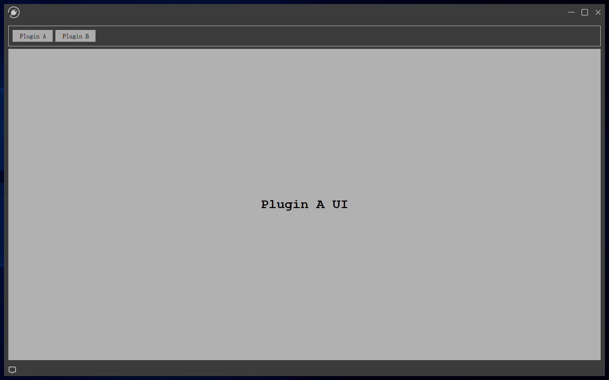
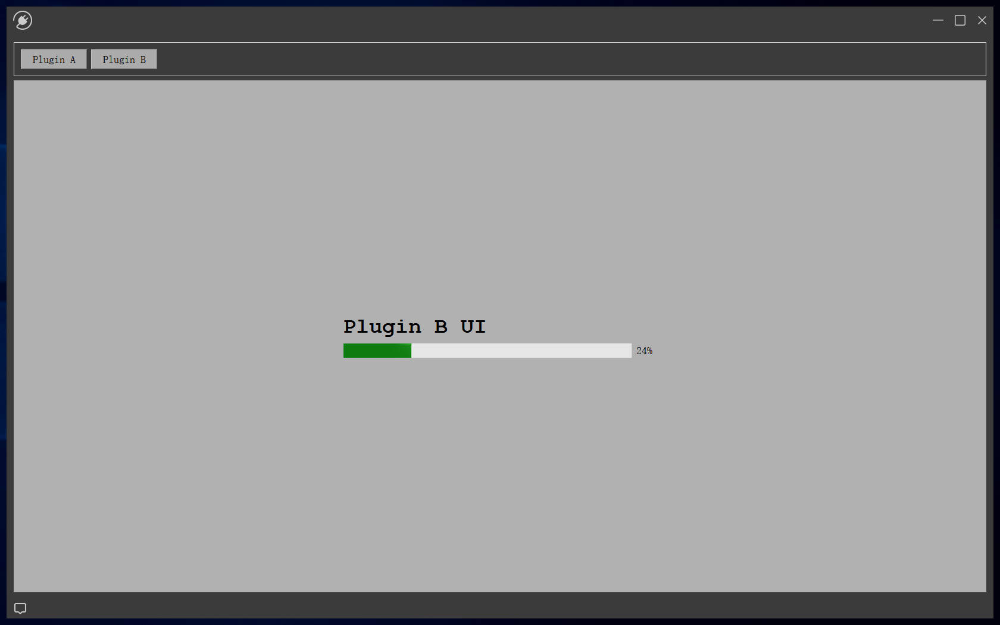

# QtWidgetPluginFramework

## 🔧 Overview

**QtWidgetPluginFramework** is an industrial-grade C++ plugin framework with a Qt GUI demonstration. It dynamically loads Qt Class Library DLL plugins (**PluginA** and **PluginB**) and switches between their QWidget UIs via QPushButtons, simulating QTabWidget functionality.

## 💡 Features

- 🧩 Modular C++ plugin system (IPlugin, PluginManager, PluginLoader, PluginInfo, PluginContext)
- 🔌 Supports dynamic loading/unloading of multiple Qt DLL plugins
- 🖥️ Switch between plugin UIs via QPushButton clicks
- 🔒 Thread-safe plugin management using std::mutex
- 📦 Designed for scalability in production applications

## 📂 Project Structure

```
QtWidgetPluginFramework/
 ├── Common/
 │   ├── PluginManager/
 ├── PluginA/
 ├── PluginB/
 ├── QtWidgetPluginFramework/
 ├── QtWidgetPluginFramework.sln
 ├── README.md
 ├── LICENSE
 ├── .gitignore
 └── ATTRIBUTION.md
```

## 🚀 Build & Run

1. Install **Qt (5.x or 6.x) Visual Studio integration**.
2. Open `QtWidgetPluginFramework.sln` in Visual Studio.
3. Build **PluginA**, **PluginB**, then **QtWidgetPluginFramework**.
4. Make sure **PluginA.dl**l, **PluginB.dll** and **QtWidgetPluginFramework.exe**. are in the same path
5. Run **QtWidgetPluginFramework.exe**.
6. Click different buttons to load and switch plugin UIs dynamically.

## 🚀 Demo

Below are the screenshots of **QtWidgetPluginFramework** running with PluginA and PluginB loaded as Qt DLL QWidget plugins.





## 📌 Assets / Icons Credit

- Some icons used in this project are sourced from [Yesicon](https://yesicon.app/).  
  Licensed under the MIT License.  
  All rights belong to their respective authors and Yesicon platform.

## 📝 License

This project is licensed under the MIT License. See [LICENSE](LICENSE) for details.

---

© 2025 Kws128